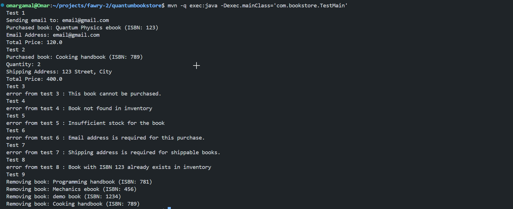

# Fawry Assessment

## Running the Application

- Ensure Maven is installed on your system.
- Compile and execute the application using the following commands:

```bash
mvn compile
mvn -q exec:java -Dexec.mainClass='com.example.App'
```

## Screenshot of running tests



## Design Decisions

- **Strategy pattern**: For the `BookStore` to maintain a polymorphic purchasing behavior among different types of books, `Purchasing Policies` are injected within the books themselves, thus on adding any new type of book or behavior, the code for the `BookStore` does not change .
- **Dependency Injection**: I assume a single shipping and email services associated with the store, though the design enables `injecting` those services `within the policies themselves`, swapping implementations easily.
- The `PurchaseInfo` DTO encapsulates the info for different typing books, so that the `buy` method remains polymorphic among different book types
- This is extensible by nature, adding a new Type of book with a new purchasing policy or behavior requires `Creating the class of the book type`, `Creating a new policy class or reusing one`, and `adding any extra property to the PurchaseInfo DTO`
